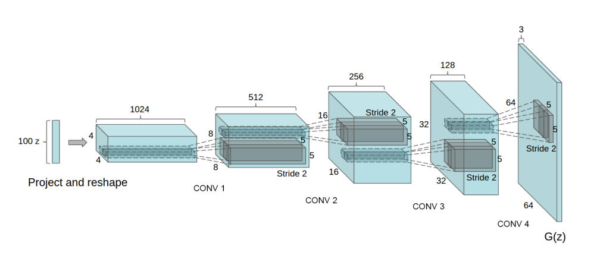

# Generative Adversarial Networks

[Generative Adversarial Networks (GANs)](https://arxiv.org/pdf/1406.2661) are a class of machine learning models introduced by Ian Goodfellow and colleagues in 2014. A GAN consists of two neural networks, trained simultaneously in a competitive setting often described as a two-player minimax game:

- **Generator $G$**: Learns to map random noise (typically sampled from a simple distribution like a standard normal) into data samples that resemble the training data. Its goal is to produce outputs that look “real.”

- **Discriminator $D$**: Learns to distinguish between real data (from the true distribution) and fake data (produced by the generator). Its goal is to correctly classify inputs as either real or generated.

The interaction between $G$ and $D$ can be likened to counterfeiters versus the police: counterfeiters (the generator) produce increasingly realistic fake currency, while the police (the discriminator) improve their ability to detect counterfeits. This adversarial process continues until the generated samples become indistinguishable from real data.

## Training Objective

The training process involves alternating updates to D and G:

1. **Sampling:** Draw real data samples $x \sim \mathbb{P}_{d}$ and random noise $z \sim \mathbb{P}_z$ (e.g., $`N(0, I)`$)
2. **Generation:** Transform $z$ through the generator to produce $\hat{x} = G(z)$.
3. **Discrimination:** Feed both $x$ and $\hat{x}$ into the discriminator, which outputs a scalar score representing the probability that the input is real.
4. **Optimization:** 
    - The discriminator is trained to maximize the probability of correctly classifying real versus generated samples.
    - The generator is trained to maximize the discriminator’s misclassification of generated samples as real.

The minimax objective is:

```math
\min_G \max_D V(D, G) = \mathbb{E}_{x \sim \mathbb{P}_{d}}[\log D(x)] + \mathbb{E}_{z \sim \mathbb{P}_{z}}[\log (1 - D(G(z)))]
```

## Dataset

This project implements GAN models trained on the [CelebA dataset](https://mmlab.ie.cuhk.edu.hk/projects/CelebA.html), which contains over 200K images of celebrity faces. The images are transformed to be 128 $\times$ 128 in dimension. Below are some examples of the images in the dataset.

## Generator Model Architecture



The generator model follows the [DCGAN](https://arxiv.org/pdf/1511.06434) (Deep Convolutional GAN) architecture, which consists of repeated upsampling and convolutional layer with ReLU activation. This model takes in vectors $z \in \mathbb{R}^{128}$ and outputs 128 $\times$ 128 $\times$ 3 pixel color images.

## Discriminator Architecture

The discriminator model is essentially the opposite of the generator, consisting of repeated convolutional downsampling. It takes as inputs a 128 \times 128 \times 3 color images and outputs a scalar-valued score that represent how likely the image comes from the real dataset rather than being produced by the generator.

## Training and Optimization

In the original GAN formulation, the discriminator outputs a probability indicating how likely a sample is to come from the real data distribution. The **Wasserstein GAN (WGAN)** redefines this quantity and instead optimizes the following objective:

```math
\min_G \max_D \mathbb{E}_{x \sim \mathbb{P}_{d}}[D(x)] - \mathbb{E}_{z \sim \mathbb{P}_{z}}[D(G(z))]
```
This formulation is derived from the **Kantorovich–Rubinstein duality**, which requires the discriminator $D$ (often called the critic in WGANs) to be a 1-Lipschitz function. In practice, we enforce this constraint by following the approach of [Gulrajani et al. (2017)](https://arxiv.org/pdf/1704.00028), which introduces a gradient penalty term:
```math
\lambda (\lVert\nabla_{\hat{x}} D_w(\hat{x})\lVert_2 - 1)^2
```

This penalty encourages the gradient norm of the critic with respect to its input $\hat{x}$ to remain close to 1, thereby ensuring the Lipschitz condition holds and stabilizing training.

The full training algorithm follows the pseudocode below:

<div style="border: 2px solid #000000; font-family: Computer Modern Roman; padding: 10px; background: #000000; display: inline-block; max-width: fit-content;">

---

**Algorithm 1** WGAN with graident penalty.

---

**Require:** The gradient penalty coefficeint $\lambda$, the number of critic iterations per generator iteration \
$n_{\text{critic}}$, the batch size $m$, Adam hyperparameters $\alpha$, $\beta_1$, $\beta_2$.\
**Require:** initial critic parameters $w_0$, initial generator parameters $\theta_0$.\
&nbsp;&nbsp;1: &nbsp;**while** $\theta$ has not converged **do**\
&nbsp;&nbsp;2: &nbsp;&nbsp;&nbsp;&nbsp;&nbsp;**for** $t = 1,...,n_{\text{critic}}$ **do**\
&nbsp;&nbsp;3: &nbsp;&nbsp;&nbsp;&nbsp;&nbsp;&nbsp;&nbsp;&nbsp;&nbsp;**for** $i = 1,...,m$ **do**\
&nbsp;&nbsp;4: &nbsp;&nbsp;&nbsp;&nbsp;&nbsp;&nbsp;&nbsp;&nbsp;&nbsp;&nbsp;&nbsp;&nbsp;&nbsp;Sample real data $`x \sim \mathbb{P}_d`$, latent variable $`z \sim \mathbb{P}_z`$, a random number $`\epsilon \sim U[0, 1]`$.\
&nbsp;&nbsp;5: &nbsp;&nbsp;&nbsp;&nbsp;&nbsp;&nbsp;&nbsp;&nbsp;&nbsp;&nbsp;&nbsp;&nbsp;&nbsp;$`\tilde{x} \leftarrow G_{\theta}(z)`$\
&nbsp;&nbsp;6: &nbsp;&nbsp;&nbsp;&nbsp;&nbsp;&nbsp;&nbsp;&nbsp;&nbsp;&nbsp;&nbsp;&nbsp;&nbsp;$`\hat{x} \leftarrow \epsilon x + (1 - \epsilon) \tilde{x}`$\
&nbsp;&nbsp;7: &nbsp;&nbsp;&nbsp;&nbsp;&nbsp;&nbsp;&nbsp;&nbsp;&nbsp;&nbsp;&nbsp;&nbsp;&nbsp;$`L^{(i)} \leftarrow D_w(\tilde(x)) - D_w(s) + \lambda (\lVert\nabla_{\hat{x}} D_w(\hat{x})\lVert_2 - 1)^2`$\
&nbsp;&nbsp;8: &nbsp;&nbsp;&nbsp;&nbsp;&nbsp;&nbsp;&nbsp;&nbsp;&nbsp;**end for**\
&nbsp;&nbsp;9: &nbsp;&nbsp;&nbsp;&nbsp;&nbsp;&nbsp;&nbsp;&nbsp;&nbsp;$`w \leftarrow \text{Adam}(\nabla_w \frac{1}{m}\sum^m_{i=1} L^{(i)}, w, \alpha, \beta_1, \beta_2)`$\
&nbsp;&nbsp;2: &nbsp;&nbsp;&nbsp;&nbsp;&nbsp;Sample a batch of latent variables $`\{z^{(i)}\}^m_{i=1} \sim \mathbb{P}_z`$.\
&nbsp;&nbsp;1: &nbsp;**end while**

---

</div>
